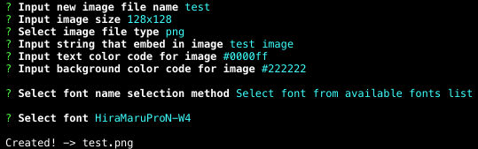

birthmark
====
Command line tool for generating image that embedded text.

### Dependencies
- [ImageMagick](https://github.com/ImageMagick/ImageMagick "ImageMagick")

### Install
***todo: publish to npm***

~~`$ npm install birthmark -g`~~

### Usage
#### Generate image with text
`$ birthmark`

